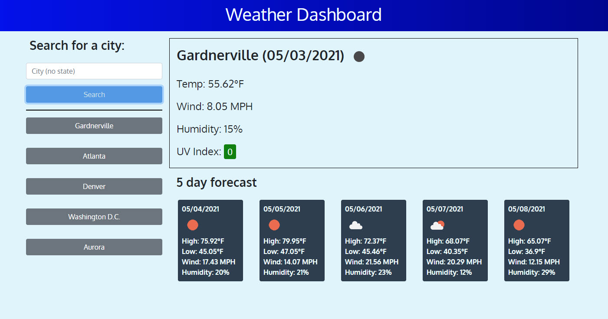

# Weather Dashboard

## Description

Build a weather dashboard that will run in the browser and feature dynamically updated HTML and CSS.

Use the [OpenWeather One Call API](https://openweathermap.org/api/one-call-api) to retrieve weather data for cities. Read through the documentation for setup and usage instructions. You will use `localStorage` to store any persistent data.

This was a good project. I have had troubles getting 3rd party APIs to work in the past. I'm not pleased with how the code came out on this one, so I started a new project and am refactoring it to make the code cleaner and easier to maintain. This works though. I found bootstrap a challenge. It didn't "just work". I had to play with the formatting quite a bit for things to display as I wanted them.

## Table of Contents

- [User Story](#user-story)
- [Acceptance Criteria](#acceptance-criteria)
- [Usage](#usage)
- [Credits](#credits)

## User Story

AS A traveler
I WANT to see the weather outlook for multiple cities
SO THAT I can plan a trip accordingly

## Acceptance Criteria

Here are the critical requirements necessary to develop a portfolio that satisfies a typical hiring manager’s needs:

```
GIVEN a weather dashboard with form inputs

WHEN I search for a city
THEN I am presented with current and future conditions for that city and that city is added to the search history

WHEN I view current weather conditions for that city
THEN I am presented with the city name, the date, an icon representation of weather conditions, the temperature, the humidity, the wind speed, and the UV index

WHEN I view the UV index
THEN I am presented with a color that indicates whether the conditions are favorable, moderate, or severe

WHEN I view future weather conditions for that city
THEN I am presented with a 5-day forecast that displays the date, an icon representation of weather conditions, the temperature, the wind speed, and the humidity

WHEN I click on a city in the search history
THEN I am again presented with current and future conditions for that city (does not reorder based on clicked)

```

## Usage

Completed site's code: [https://github.com/Chip-L/weatherDashboard]

Working Page: [https://chip-l.github.io/weatherDashboard/]



## Credits

Study Group:

- Lauren Gabaldon
- Josh Lee
- Jared Sutch
- Lacey Pape
- Alex Jurgs
- Tarik Maggio

Wikimedia Foundation. (2021, March 13). Ultraviolet index. Wikipedia. https://en.wikipedia.org/wiki/Ultraviolet_index#Index_usage.
